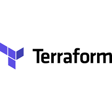

# jobs-salary-in-data-field
### Exploring Salary Dynamics and Employment Trends in Data Careers

I used this dataset [Jobs and Salaries in Data Field Dataset](https://www.kaggle.com/datasets/murilozangari/jobs-and-salaries-in-data-field-2024?rvi=1)
 which provides insights into data field job salaries from 2020 to 2024, including information on experience levels, employment types, job titles, and company characteristics. It serves as a valuable resource for understanding salary trends and factors influencing compensation in the data field. 

I build ETL pipeline on this data to answer the most frequentaly asked questions:
- Total salary in USD paid for each work_year and emplyment_type
- Total salary in USD paid for each company_size and emplyment_type
- The most job_category and experience_level wanted in data field market

The process which I took to build ETL pipeline:
1. Create resources needed as: Google Cloud Storage Bucket, Google Cloud BigQuery Dataset, and Google Cloud DataProc Cluster using Terraform

2. Use orchestration tool Mage to read data and load as it is into Data Lake which is Google Cloud Storage Bucket

3. Creating Pyspark job to read data on specific schema from Google Cloud Storage Bucket, then apply some transformations and then load transformed/cleansed data into Google Cloud BigQuery Dataset
Transformations applied:
- Drop unneeded columns
- Modify company_size column values with replace S->Small  , M->Medium, L->Large
  
5. Execute Pyspark job using Google Cloud DataProc Cluster

6. Create dashboard in Google Cloud Studio (Looker) [Dashboard Link](https://lookerstudio.google.com/reporting/b32c26d1-1bb9-498f-8448-08656a996169)

    

